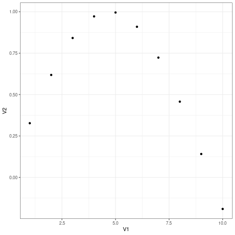
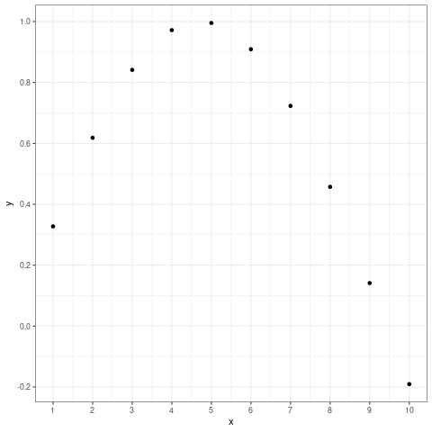
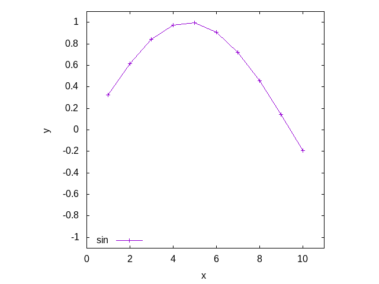

# はじめに


<a id="org0c32372"></a>

## 文書

ファイルは <https://github.com/osada-yum/examples> の `R_ggplot2/` ディレクトリにある.

Emacsのorg文書はリテラルプログラミングに対応しているので, .org のファイルを使うことで, この文書のサンプルを実行できる.

<a id="orgec7b521"></a>

## 実行環境

-   Ubuntu 20.04
-   org-9.5.2 on Emacs-28.0.50
-   gnuplot 5.2 patchlevel 8
-   R version 3.6.3 (2020-02-29)


<a id="org90b1e36"></a>

# やりたいこと

-   gnuplot並に簡単にプロットをしたい.


<a id="org31221d2"></a>

# gnuplotから引っ越す

-   gnuplotは簡易的にデータを可視化するには取り回し易い.

    `plot "filename"` でプロットできる.
-   データの加工は面倒.

    できなくはないんだろうけど.


<a id="org6f917c3"></a>

## R+ggplot2の利点

-   Rの機能が使える.
    -   ファイルからデータを読み込んで加工してプロットするのが楽.
    -   `head(data)` とかでデータの上をちょっと覗いたり, `summary` で統計を取ったりしやすい.
-   プロットの設定を弄りやすい.

    テーマを変えたりプロットの枠を変えたりとか.
-   別のRパッケージでより便利になる.

    `patchwork` (プロットを並べられる)とか

    `gganimate` (.gif作れる)とか
-   ラベルとかに日本語が使える.

    gnuplot では使えない?


<a id="org9f558d0"></a>

## R+ggplot2の欠点

-   ggplot2単体ではプロットをマウスで動かせない.

    `plotly` や `ggplotgui` (ブラウザ上でプロットを設定できる)とかを使えば可能.
-   日本語の文書が少ない.

    とりあえず, \`\` `R ggplot2` '' とかで検索?
-   `gnuplot` に比べると行数が増える.


<a id="orgece263d"></a>

# デモ

一部の画質が粗いのは, おそらくorg-babelで出力しているから. `ggsave()` 関数を使えば dpi を弄れるので問題なし.


<a id="orgdb445ac"></a>

## ファイルをプロットしたい


<a id="orgf8b4597"></a>

### emacsのorg-babel用の設定

```emacs-lisp
(org-babel-do-load-languages
 'org-babel-load-languages
 '((emacs-lisp . t)
   (gnuplot    . t)
   (R          . t)))
```


<a id="orgb1d68aa"></a>

### ファイルの中身

`sin.dat`

```bash
cat sin.dat
```

|    |             |
| -- | ----------- |
| 1  | 0.3271947   |
| 2  | 0.6183698   |
| 3  | 0.84147096  |
| 4  | 0.971937    |
| 5  | 0.99540794  |
| 6  | 0.9092974   |
| 7  | 0.7230859   |
| 8  | 0.45727262  |
| 9  | 0.14112     |
| 10 | -0.19056797 |

`cos.dat`

```bash
cat cos.dat
```

|   |            |
| -- | ---------- |
| 1 | 0.9950042  |
| 2 | 0.9800666  |
| 3 | 0.9553365  |
| 4 | 0.921061   |
| 5 | 0.87758255 |
| 6 | 0.8253356  |
| 7 | 0.7648422  |
| 8 | 0.6967067  |
| 9 | 0.62161    |


<a id="org6ad762b"></a>

### gnuplotなら

-   凄い簡単.
-   データを可視化したいだけなら, これだけでOK.

```gnuplot
plot "sin.dat"
```

<!--  -->


<a id="orge793a9e"></a>

### R+ggplot2で愚直にプロット

-   `ggplot2` をインストールする.

```R
install.packages("ggplot2")
```

-   `ggplot2` のライブラリを読み込む.

```R
library(ggplot2)
```

-   `read.table` 関数でファイルを読み込む.
-   \`\` `.` '' は名前の一部であり, メソッドアクセス演算子ではない.
-   列の名前はV1, V2, &#x2026;となっている. `colnames` 関数で変更することも可能.

```R
d_sin <- read.table("sin.dat", header = F)
head(d_sin, n = 2)
```

| V1 | V2        |
|--- |--------- |
| 1  | 0.3271947 |
| 2  | 0.6183698 |

-   `ggplot()` と部品(`geom_point` とか)を `+` で組み合わせてプロットする.
-   以下も可能.
    -   `ggplot(data = d_sin) + geom_point(aes(x = V1, y = V2))`

        `geom_point(aes(x = V1, y = V3))`を追加すれば別の列もプロットできる.
    -   `ggplot(data = d_sin, aes(x = V1, y = V2)) + geom_point()`

        `geom_line()`で点と線を一緒にプロットできる.
    -   `ggplot() + geom_point(data = d_sin, aes(x = V1, y = V2))`

        `geom_point(data = another, aes(x = V5, y = V1))`で別の `data.frame` のデータも一緒にプロットできる

```R
plt <- ggplot(data = d_sin) + geom_point(aes(x = V1, y = V2))
plt
```

<!--  -->


<a id="orge0d668f"></a>

### gnuplotに似せる

#### themeの設定

```R
plt_theme <- plt + theme_bw()
plt_theme
```

<!--  -->


#### breakの設定

(`gnuplot` でいうticks.)

```R
plt_breaks <- plt_theme +
  scale_x_continuous(breaks = seq(from = 1.0, to = 10.0, by = 1.0)) +
  scale_y_continuous(breaks = seq(from = -0.2, to = 1.0, by = 0.2))
plt_breaks
```

<!--  -->


#### labelの設定

```R
plt_label <- plt_breaks + xlab("x") + ylab("y")
plt_label
```

<!--  -->


#### aesの中でshapeとかcolorを指定するとlegendが出る

-   `%+%` で既存の要素を置き換えられるらしい.

```R
plt_legend <- plt_label %+%
  aes(shape = "サイン", color = "サイン")
plt_legend
```

<!--  -->


#### shapeとcolorを変える

```R
plt_legend2 <- plt_legend +
  scale_shape_manual("functions", values = c(3)) +
  scale_color_manual("functions", values = c("#990066"))
plt_legend2
```

<!--  -->


#### legendの位置を変更

legendの左下(0.0, 0.0)を図の(0.1, 0.1)へ持っていく.

```R
plt_legend_position <- plt_legend2 +
  theme(legend.justification = c(0.0, 0.0)
      , legend.position      = c(0.1, 0.1))
plt_legend_position
```

<!--  -->


#### legendに囲みを変更

```R
plt_legend_box <- plt_legend_position +
  theme(legend.background     = element_blank()
      , legend.box.background = element_rect(color = "black"))
plt_legend_box
```

<!--  -->


#### 文字を大きく, 色を黒に

```R
plt_text_prop <- plt_legend_box +
  theme(legend.text  = element_text(size = 20)
      , legend.title = element_text(size = 20)
      , axis.text  = element_text(size = 20, color = "black")
      , axis.title = element_text(size = 24))
plt_text_prop
```

<!--  -->


#### legendのタイトルとグリッドを消去する

```R
plt_grid <- plt_text_prop +
  theme(legend.title = element_blank()
      , panel.grid = element_blank())
plt_grid
```

<!--  -->


#### ticksを内側に変更する.

ticksのテキストのマージンも変更する.

```R
plt_ticks <- plt_grid +
  theme(axis.text.x  = element_text(margin = margin(t = 0.5, unit = "cm"))
      , axis.text.y  = element_text(margin = margin(r = 0.5, unit = "cm"))
      , axis.ticks.length=unit(-0.25, "cm"))
plt_ticks
```

<!--  -->


#### アスペクト比を変更する

```R
plt_aspect <- plt_ticks +
  theme(aspect.ratio = 3/4)
plt_aspect
```

<!--  -->


#### 比較

-   結構似ている.
-   ここまでする必要はないが, 色々自由に設定できる.

<!--  -->


<!--  -->


<a id="orgde60d9c"></a>

## ファイルに書き込む


<a id="org934a062"></a>

### gnuplotなら

```gnuplot
set size square
set terminal png
set output 'sin_gnuplot_output.png'
plot "sin.dat" using 1:2 with points
```

<!--  -->


<a id="org07858ed"></a>

### R+ggplot2

```R
plt <- ggplot(data = d_sin) + geom_point(aes(x = V1, y = V2))
ggsave(filename = "sin_ggplot2_output.png"
     , plot = plt
     , width = 7, height = 7)
```

<!--  -->


<a id="orga8202ae"></a>

## 範囲を指定


<a id="orgb217901"></a>

### gnuplotなら

```gnuplot
set size square
set xrange [0:11]
set yrange [-1.1:1.1]
set xtics 2
set ytics 0.2
set xlabel "x"
set ylabel "y"
set key left bottom
plot "sin.dat" using 1:2 with linespoints title "sin"
```

<!--  -->


<a id="orgd453860"></a>

### R+ggplot2

-   行末に `+` を置くと行を跨げる.
-   `geom_point` と `geom_line` を同時に使える.
-   `scale_x_continuous` と `scale_y_continuous` の引数 `breaks` と `limits` にベクトル `c(...)` を渡す.
    -   `limits` に渡すのは2要素のベクトル.
-   `scale_shape_manual` と `scale_color_manual` の引数 `values` にベクトルを渡す.
    -   gnuplotのlinetypeやlinecolorみたいなもの.
    -   shapeやcolorの数文の長さのベクトルが必要.

```R
plt_range <- ggplot(data = d_sin, aes(x = V1, y = V2, shape = "sin", color = "sin")) +
  geom_point() + geom_line() +
  scale_x_continuous(breaks = seq(from = 0.0 , to = 10.0, by = 2.0)
                   , limits = c(0, 11)) +
  scale_y_continuous(breaks = seq(from = -1.0, to = 1.0 , by = 0.2)
                   , limits = c(-1.0, 1.0)) +
  scale_shape_manual("functions", values = c(3)) +
  scale_color_manual("functions", values = c("#990066")) +
  xlab("x") + ylab("y") +
  theme_bw() +
  theme(axis.text  = element_text(size = 20, color = "black")
      , axis.title = element_text(size = 20)
      , legend.text  = element_text(size = 20)
      , legend.title = element_blank()
      , legend.justification = c(0.0, 0.0)
      , legend.position      = c(0.05, 0.05)
      , panel.grid = element_blank()
      , axis.ticks.length = unit(-0.25, "cm")
      , axis.text.x       = element_text(margin = margin(t = 0.5, unit = "cm"))
      , axis.text.y       = element_text(margin = margin(r = 0.5, unit = "cm")))
plt_range
```

<!--  -->


<a id="org8c3ebdb"></a>

## 複数ファイルをプロット


<a id="org05ebeb8"></a>

### gnuplot

```gnuplot
set size square
set xrange [0:11]
set yrange [-1.1:1.1]
set xtics    1,    2, 11
set ytics -1.0, 0.25, 1.0
set xlabel "x"
set ylabel "y"
set key left bottom
plot "sin.dat" using 1:2 with linespoints title "sin",\
     "cos.dat" using 1:2 with linespoints title "cos"
```

<!--  -->


<a id="org63a8a18"></a>

### R+ggplot2

#### 愚直に

-   themeを使いまわすために, `mytheme` 変数に代入しておくことができる.

    xとyのscaleも使いまわす.

```R
d_cos <- read.table("cos.dat", header = F)

mytheme <-
  theme(axis.text  = element_text(size = 20, color = "black")
      , axis.title = element_text(size = 20)
      , legend.text  = element_text(size = 20)
      , legend.title = element_blank()
      , legend.justification = c(0.0, 0.0)
      , legend.position      = c(0.05, 0.05)
      , panel.grid = element_blank()
      , axis.ticks.length = unit(-0.25, "cm")
      , axis.text.x       = element_text(margin = margin(t = 0.5, unit = "cm"))
      , axis.text.y       = element_text(margin = margin(r = 0.5, unit = "cm")))

my_x_scales <-
  scale_x_continuous(breaks = seq(from = 1.0 , to = 11.0, by = 2.0)
                   , limits = c(0, 11))
my_y_scales <-
  scale_y_continuous(breaks = seq(from = -1.0, to = 1.0 , by = 0.25)
                   , limits = c(-1.0, 1.0))

plt_multifile <- ggplot() +
  geom_point(data = d_sin, aes(x = V1, y = V2, shape = "sin", color = "sin")) +
  geom_line(data = d_sin, aes(x = V1, y = V2, shape = "sin", color = "sin")) +
  geom_point(data = d_cos, aes(x = V1, y = V2, shape = "cos", color = "cos")) +
  geom_line(data = d_cos, aes(x = V1, y = V2, shape = "cos", color = "cos")) +
  my_x_scales + my_y_scales +
  scale_shape_manual("functions", values = c(3:4)) +
  scale_color_manual("functions", values = c("#990066", "#009900")) +
  xlab("x") + ylab("y") +
  theme_bw() + mytheme
plt_multifile
```

<!--  -->


#### data.frameの構造を変えてプロット

-   `data.frame` に新しい列に関数の種類を文字列で代入する.
-   `rbind` で2つを合体させる.

```R
d_sin2 <- d_sin
d_cos2 <- d_cos
d_sin2$func <- "sin"
d_cos2$func <- "cos"
d_sincos <- rbind(d_sin2, d_cos2)
d_sincos
```

| V1 | V2         | func |
|--- |---------- |---- |
| 1  | 0.3271947  | sin  |
| 2  | 0.6183698  | sin  |
| 3  | 0.8414710  | sin  |
| 4  | 0.9719370  | sin  |
| 5  | 0.9954079  | sin  |
| 6  | 0.9092974  | sin  |
| 7  | 0.7230859  | sin  |
| 8  | 0.4572726  | sin  |
| 9  | 0.1411200  | sin  |
| 10 | -0.1905680 | sin  |
| 1  | 0.9950042  | cos  |
| 2  | 0.9800666  | cos  |
| 3  | 0.9553365  | cos  |
| 4  | 0.9210610  | cos  |
| 5  | 0.8775825  | cos  |
| 6  | 0.8253356  | cos  |
| 7  | 0.7648422  | cos  |
| 8  | 0.6967067  | cos  |
| 9  | 0.6216100  | cos  |

-   `shape` と `color` に `func` を指定する.

    `"sin"` と `"cos"` で分別する.

```R
plt_onedataframe <- ggplot(data = d_sincos
                         , aes(x = V1, y = V2, shape = func, color = func)) +
  geom_point() + geom_line() +
  my_x_scales + my_y_scales +
  scale_shape_manual("functions", values = c(3:4)) +
  scale_color_manual("functions", values = c("#990066", "#009900")) +
  xlab("x") + ylab("y") +
  theme_bw() + mytheme
plt_onedataframe
```

<!--  -->


<a id="orgcf78290"></a>

# まとめ

-   基本的には `ggplot(data = mydata)` に色々足していけばよい.

    `geom_point` や `geom_line` とか.
-   `aes(x = myx, y = myy)` でデータフレームのどの列を使うかを指定する.

    shape とか color とかも指定できる.


<a id="orgdc3d650"></a>

# もっと


<a id="org97e6354"></a>

## 参考URL

-   ggplot2のマニュアル

https://cran.r-project.org/web/packages/ggplot2/ggplot2.pdf

-   Matplotlib VS Ggplot2

    matplotlib と ggplot2 との比較.

https://towardsdatascience.com/matplotlib-vs-ggplot2-c86dd35a9378


<a id="org0ec5a44"></a>

## プロットをマウスとかで弄るには

gnuplotではプロットをマウスでぐりぐりできるが, ggplot2ではplotlyみたいなライブラリが必要.

https://plotly.com/r/

ggplotguiみたいなライブラリを使えばブラウザ上でグリグリしたり, プロットの設定を弄ったりできる.

https://cran.r-project.org/web/packages/ggplotgui/README.html

他にも色々あるらしい.

https://note.com/tqwst408/n/n82d56c69a18e


<a id="orgd169a79"></a>

## プロットを横とか縦に並べるには

patchworkライブラリを使うとよい.

https://cran.r-project.org/web/packages/patchwork/patchwork.pdf

https://qiita.com/nozma/items/4512623bea296ccb74ba


<a id="orgd1a7401"></a>

## GIFアニメを作る.

gganimateライブラリを使うとよい.

https://gganimate.com/
